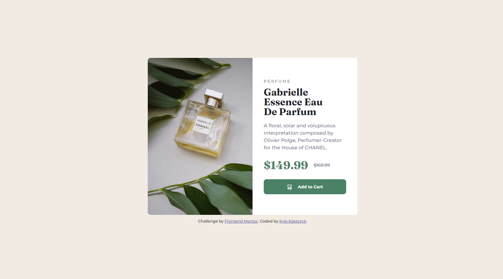
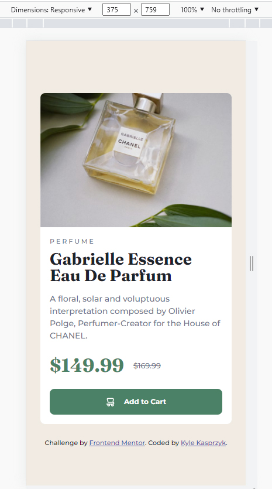

# Frontend Mentor - Product preview card component solution

This is a solution to the [Product preview card component challenge on Frontend Mentor](https://www.frontendmentor.io/challenges/product-preview-card-component-GO7UmttRfa). Frontend Mentor challenges help you improve your coding skills by building realistic projects. 

## Table of contents

- [Overview](#overview)
  - [The challenge](#the-challenge)
  - [Screenshot](#screenshot)
  - [Links](#links)
- [My process](#my-process)
  - [Built with](#built-with)
  - [What I learned](#what-i-learned)
  - [Continued development](#continued-development)
  - [Useful resources](#useful-resources)
- [Author](#author)
- [Acknowledgments](#acknowledgments)

## Overview

### The challenge

Users should be able to:

- View the optimal layout depending on their device's screen size
- See hover and focus states for interactive elements

### Screenshot

Desktop

Mobile at 375px

### Links

- Solution URL: [Add solution URL here](https://your-solution-url.com)

## My process

### Built with

- Semantic HTML5 markup
- CSS custom properties
- Flexbox
- CSS Grid

### What I learned

This project level is 'NEWBIE' and I learned I am a newbie. 

Starting off with the basic HTML and CSS files, I began working on the desktop view.  After 30 minutes, I scrapped the files and started over.  This is when I learned the importance of having a CSS reset to begin projects.  This is a helpful tool to get started and something I missed (or was not discussed) in the tutorials I've completed.

The CSS reset I used was created by Josh W Comeau, and you can view it here https://www.joshwcomeau.com/css/custom-css-reset/.

I will admit, I spent 25 to 30 minutes trying to figure out why the cart icon and text within the button were not aligned.  I tried everything I learned from those CSS and HTML tutorials, but then found a little thing called justify-content.  Entered the code and boom, frustration turned into accomplishment.  I'm still a newbie so I'm not sure if this was the correct approach, but it worked visually and I was ready to complete the challenge.

### Continued development

I will be continuing with the challenges at Frontend Mentor.  These will help me improve my HTML, CSS, and JavaScript needed to be proficient at web development.  

### Useful resources

- [MDN Web Docs](https://developer.mozilla.org/en-US/) - Great reference.
- [W3Schools](https://www.w3schools.com/) - Another great reference.

## Author

- Frontend Mentor - [@kylekasprzyk](https://www.frontendmentor.io/profile/kylekasprzyk)

## Acknowledgments

Thank you for reading this far.  I would like to acknowledge you for taking the time to view this while I am learning to code.